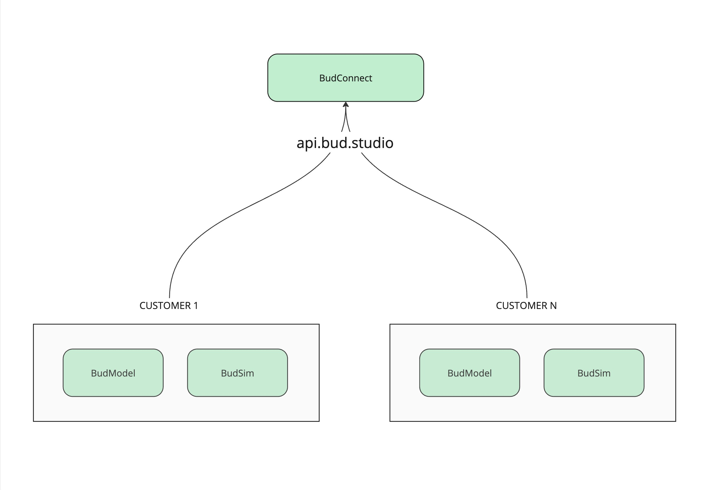
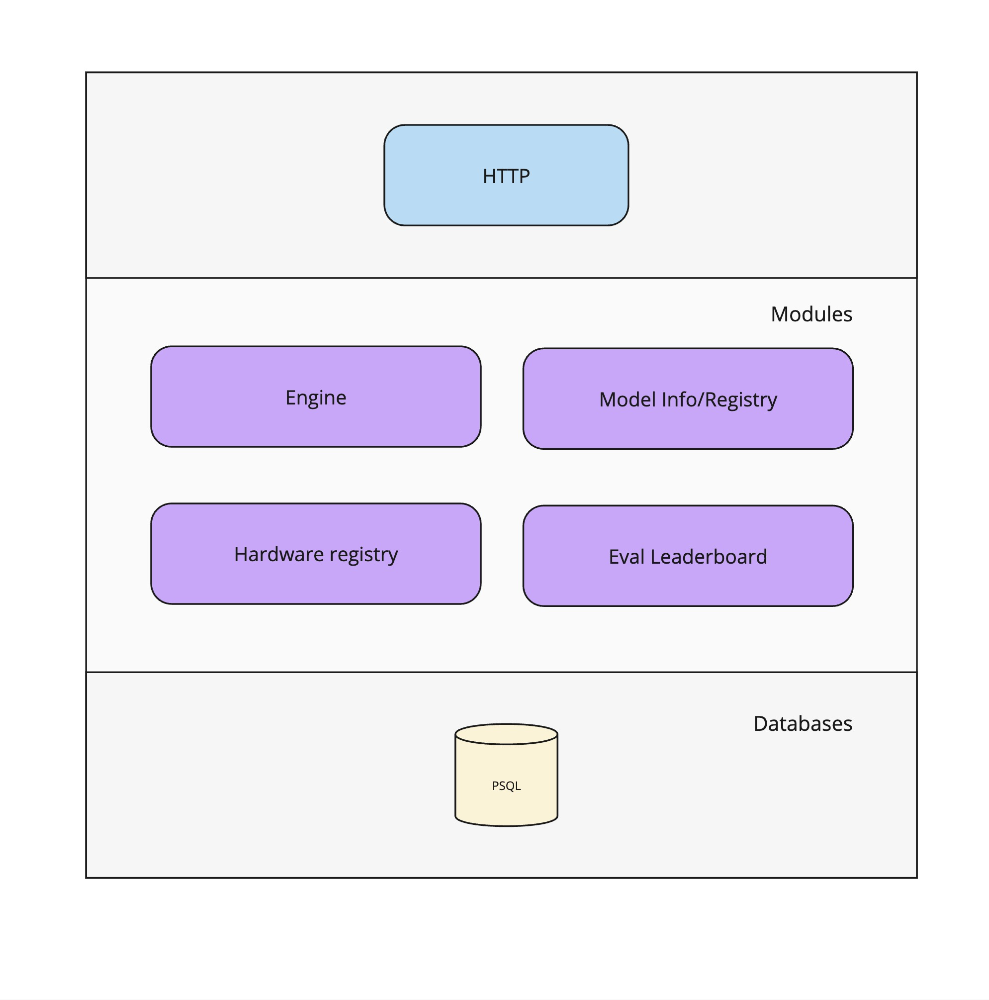

# Architecture Overview

BudConnect is aimed to be a cloud service which allows the Bud Runtime deployments to get regular updates related to engine versions, leaderboards, and other resources.

The architecture is based on the following modules:

Engine: This module is responsible for the engine versions, model compatibilities, and other engine related resources.

Leaderboard: This module is responsible for the leaderboards, and other leaderboard related resources.

Model: This module is responsible for the models info, license, and other model related resources.

Hardware: This module is responsible for the hardware info, cost, and other hardware related resources.

### API

The service accessible to the deployment via a REST API.

